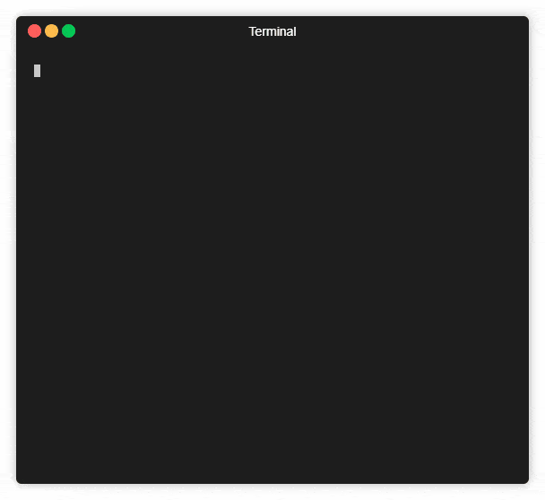

# DNS Scanner

Fast brute DNS records to find subdomains.

## Features

-   Fast (20-30 seconds to scan 10000 records)
-   Included 10k records subdomain dictionary
-   Recursively scan

## Installation

```sh
npm install -g dns-scanner
```

## Usage:

### Usage: Command line

Usage: `dns-scanner [options] <domains ...>`



Example using built-in dictionary with some domains:

```sh
root@debian:~# dns-scanner rambler.ru mail.ru ya.ru
```

Example using personal dictionary:

```sh
root@debian:~# dns-scanner -f ./dic.txt apple.com
```

#### Options

```
-f, --file [value]  Dictionary file
-r, --recursive     Recursively scan sub-domains
-v, --verbose       Show scanning details info
-h, --help          output usage information
```

### Usage: In your code

```js
const target = 'rambler.ru';
const scanner = new DNSScanner({
    target,
    prefixes: ['www', 'mail', 'ftp', 'webmail', 'smtp', 'pop'],
    concurrency: 100,
});

scanner.start();

scanner.on('progress', ({ current, total, percent }) => {
    // on each prefix processed
});

scanner.on('item', ({ address, ips }) => {
    // on found domain-item
});

scanner.on('done', res => {
    // on end of scanning
});

scanner.on('error', res => {
    // on any errors
});
```

## License

MIT
